```{r setup, include=FALSE, message = FALSE}
options(scipen = 0, digits = 3)  # controls number of significant digits printed
library(tidyverse)
library(kableExtra)
library(readr)
library(knitr)
library(rmarkdown)
library(tinytex)
tinytex::tlmgr_update()
options(tinytex.verbose = TRUE)
```

\bigskip

The code to reproduce this report is available [on Github](https://github.com/Katsevich-Teaching/final-project-template).

\newpage

# Executive Summary

**Problem.** The rapid increase in political polarization in the United States over the past decade accompanies the rise of big data analytics, and its expansion into fields outside of tech. As topics such as broadening voter access and abolishing the electoral college become more hotly debated, the intersection between politics and analytics presents the unique opportunity to gain insight into the perspective of the American voter. Therefore, relying on county-level data, we aimed to analyze the relationship between election results in 2020 and various health, demographic, and socioeconomic characteristics of county residents. All of the data was collected in 2020, enabling us to examine the impact of the COVID-19 pandemic on voting behavior as well. Our main goal was to understand which factors have the largest influence over whether a county goes red or blue.  

**Data.** Our dataset pulled data from two sources: a New York Times time series dataset which includes cumulative counts of COVID-19 cases and deaths at the county level, and data from County Health Rankings & Roadmaps, a program focused on collecting county-level data on a variety of health determinants. For the latter data source, we pulled 2019 or older data from various datasets on their website, as many key variables we wanted to study are still missing for 2020 and we assume that most county-level health determinants stayed very similar from 2019 to 2020. Our explanatory variables span the four main categories of health factors that the program identifies: health behaviors (e.g., smoking, sexual activity), clinical care (e.g., flu vaccine rate), social and economic factors (e.g., unemployment rate), and physical environment (e.g., degree of air pollution). Our primary response variable of interest was deaths per cases, which we created by dividing county-level deaths by count-level cases.

**Analysis.** Since we pulled raw data from multiple sources, our analysis began with data wrangling and cleaning to ensure a usable dataset. Since we planned to build models and test their performance via prediction, we made sure to split our data into separate training and test datasets before conducting any exploratory analyses. Then, using the training set, we explored our response and explanatory variables, looking for skewness, potential multicollinearity, and possible relationships between the response and explanatory variables. To understand how to best model the data in order to make useful election result predictions, we drew on two key classes of machine learning methodologies: regression modeling and tree modeling. Of the three regression models we built, had the best performance. In the tree methods category, the random forest model had the lowest misclassification error.

**Conclusions.** Interestingly, we found that the boosted and elastic net regression both pointed to similar types of variables as the strongest predictors of deaths per cases. Specifically, our optimal boosted model revealed that variables related to residential segregation and unemployment emerged as the most significant predictors, revealing that structural economic and health access inequalities were more predictive of COVID-19 deaths per cases than other variables. We hope that this analysis can inform policies aimed at improving health outcome determinants, both in the context of COVID-19 and more generally going forward.

# Introduction

**Background.** Under the two-party system, the political divide in the United States between right and left has grown rapidly. In the past, Americans have identified more closely with moderate political ideologies. However, according to a study conducted by Pew Research Center in 2014, the percentage of Americans who consider themselves to be strict conservatives or liberals has risen from 10% to 21% over the past 20 years.^[“Political Polarization in the American Public.” https://www.pewresearch.org/politics/2014/06/12/political-polarization-in-the-american-public/. 
] Moreover, the ideological gap between the political left and right has grown as well - the same study pointed to a shrinking list of issues that parties see eye-to-eye on as a symptom of this growing partisanship.^[Ibid.] Interestingly, upon analyzing public opinion in other democracies, this seems to be a uniquely American trend. Americans’ opinions of members of the opposing political parties have worsened faster than between citizens in countries like Canada, Australia, Germany, and the U.K.^[“U.S. is polarizing faster than other democracies, study finds.” https://www.brown.edu/news/2020-01-21/polarization]

Simultaneously, key shifts in demographic and socioeconomic trends in the U.S. have important political implications. An aging population, unprecedented racial and ethnic diversity, and projections for sharp increases in immigration in the coming years are changing the makeup of the American voting population. Additionally, Americans find themselves grappling with a variety of modern issues. As the wealth gap widens, median household incomes have yet to reach their pre-recession level.^[“Trends in Income and Wealth Inequality.” https://www.pewresearch.org/social-trends/2020/01/09/trends-in-income-and-wealth-inequality/]. Health disparities, inequitable access to education, and racial discrimination are all social challenges that affect how American voters approach politics.^[“Views of the major problems facing the country.” https://www.pewresearch.org/politics/2019/12/17/views-of-the-major-problems-facing-the-country/]

These coinciding political and demographic trends play out on the election stage, shaping how politicians and policymakers should interact with their constituents, and revealing what matters most to American voters. 

**Analysis goals.**In light of the amount of political diversity across the U.S., the rise in ideology-based partisanship, and the variety of factors that determine party identification, our objective for this analysis was to understand how county-level results from the 2020 presidential election were affected by various health, demographic, and socioeconomic characteristics. We sought to identify the variables in these categories that best predict which party wins in each county. 

**Significance.** By identifying the key factors that help determine winning political parties in different regions in the U.S., we hope to shed new light on the issue of political polarization; our analysis points to issues that are important political conflicts, lending insight into how to build bridges in an increasingly hostile political environment.

# Data

## Data sources

Our dataset merged data from multiple sources: the MIT election lab for county election results, the CDC for COVID death rates by county, the NYT for mask usage by county, the USDA Economic Research Service for education, population, unemployment, and poverty data, and County Health Rankings and Roadmap for various other socio-economic data.

The first dataset we consulted was the MIT Election Lab. Having county level votes from 1976 to 2020, the Election Lab is a clearinghouse for datasets that can fuel studies on elections and how they're conducted. This dataset was crucial in determining whether a county voted Democrat or Republican in the 2020 U.S. election in particular.^[MIT Election Lab. Data. https://electionlab.mit.edu/data]

The County Health Rankings and Roadmap data includes observations from 2020.^[County Health Rankings & Roadmaps. https://www.countyhealthrankings.org/] This program provides data, evidence, guidance, and examples to build awareness of the multiple factors that influence health and support community leaders working to improve health and increase health equity. In particular, the program considers all of the counties in the United States and has measures relating to health behaviors, clinical care, social and economic factors, and the physical environment.^[County Health Rankings & Roadmaps. 2021 Measures. https://www.countyhealthrankings.org/explore-health-rankings/measures-data-sources/2021-measures] Because we wanted to use as many features as possible, we also incorporated data from the USDA Economic Research Service. Specifically, they provided broader socioeconomic indicators like poverty rates, population change, unemployment rates, and education levels which vary geographically across states and counties. The USDA Economic Research Service data spanned across 1990 to 2020.^[U.S. Department of Agriculture. Economic Research Service. https://www.ers.usda.gov/data-products/county-level-data-sets/]

After we collected general socioeconomic data on the United States counties, we also wanted to consider how COVID played a role in the U.S. election. That is why we looked to the CDC and the NYT. The CDC was able to provide provisional COVID-19 deaths by county from the beginning of 2020 to the present (in this case, mid-December 2021). The NYT mask-wearing data comes from a large number of interviews conducted online. The survey asked a question about mask use in each county to obtain 250,000 survey responses between July 2, 2020 and July 14, 2020.^[The New York Times Github. nytimes/covid-19-data. https://github.com/nytimes/covid-19-data]

Finally, in order to clean the datasets nicely, we also used one table that matches a state’s abbreviation with its full name^[dataset State ANSI FIPS. dantonnoriega/us-state-ansi-fips.csv. https://gist.github.com/dantonnoriega/bf1acd2290e15b91e6710b6fd3be0a53] and another table that matches a county’s FIPS code with it’s county name and state abbreviation.^[FIPS Codes. kjhealy/fips-codes. https://github.com/kjhealy/fips-codes/blob/master/state_and_county_fips_master.csv]

## Data cleaning

The cleaning process was quite intensive as we had to clean and then combine 10 different CSV files. We did some generic cleaning for all of the datasets. This means that we had to rename columns appropriately (some datasets had codes as their columns that required a data dictionary to be interpretable while others were in the incorrect casing). For some of the datasets, we had to get rid of any non-county observations, filter out all the non-2020 data, and omit any NA observations. The only way to get rid of non-county data was to look at the FIPS and see if it was divisible by 1000. That is because the country and each state have a FIPS that is divisible by 0 whereas individual counties do not. We only wanted county-level observations, so including state- and county-aggregate observations would have not been helpful. 

For the fips dataset, we renamed the columns more appropriately to represent the values they contained, and we also renamed the county values to get rid of the word “County” after each observation. Furthermore, we combined it with the states dataset, so that we could have the full names of the states rather than the abbreviations.

For the election data, we only wanted to look at total votes in each county rather than “2nd Absentee”, “Absentee”, “Early Voting”, etc. We also put all the character observations in title case. Furthermore, we used pivot_wider to condense all the different party votes for a county into one observation. This greatly reduced the number of rows we had since each county was represented five times (one for each party: Democrat, Republican, Green, Libertarian, and Other). Next, we created new columns that determined the leading party (based on the highest number of votes in that county) and the percentage of the vote for each party (for data exploration later). We also removed unnecessary/redundant columns that weren’t related to the fips, vote count, and the leading party.

For the county health data, we had to remove a lot of columns with multiple NA observations because we wanted a full dataset when going through our modeling and predictions. We went from over 100 features to only 26 features from the county health rankings dataset. One small additional thing that had to be cleaned was that the first row contained all the column names and thus needed to be appropriately renamed.

The COVID and mask data were a lot more straightforward to clean. For the COVID data, the only unique cleaning that had to be done was to create a new column that calculated the proportion of COVID deaths out of total deaths. The mask data only required generic cleaning.

Regarding the USDA data, the education data had a lot of unnecessary columns and we only wanted the columns pertaining to the county’s most recent education levels. For the population data, we had to alter column values from “Population [Year]” to just the year. Once we did that, we were able to do some generic cleaning as mentioned before. For the unemployment data, we wanted to filter for unemployment rate and median household income. Once we got those attributes only, we used pivot_wider to provide the unemployment rate and median household income for each county, and then we did generic cleaning. For the poverty dataset, the only unique cleaning step was to log transform the poverty rating for each county since the observations were very positively skewed.

After we cleaned these individual datasets, we had to do a bunch of inner_joins calls. We used the clean FIPS dataset and individually joined them with each of the other datasets mentioned before. This was important because it provided clean state and county names for the various features in each dataset, which is important for assigning values to region and subregion when making country maps during the exploration step.

Finally, we joined all of the data together in one larger “master” dataset. When doing so, we also added some new columns. We created a “pct_voters” column (which calculates how much of the county population voted), a “log_population” column (which is a log transformation of the population since it is heavily skewed), and a “log_traffic_volume” column (which is a log transformation of the traffic volume since it is heavily skewed).

## Data description

### Observations

Our dataset has a total of 716 observations, corresponding to each of the counties included in our analysis.

### Response Variable

Our response variable is the leading party in each county in the U.S. We created this variable via a simple mutate operation that tallied the number of votes for each party and then chose the maximum number of votes. We use the leading party as a proxy for party preference for each county simply because that is how elections work for the most part. Naturally, this disadvantages counties where the party split is closer to 50-50, but this is the best way to put political preferences into a single response variable.

### Features

Drawing on data from County Health Rankings & Roadmaps, we included 41 explanatory variables in our analysis, which fall into four main categories: health behaviors, clinical care, social and economic factors, and physical environment. For a detailed specification of these variables, refer to Appendix \@ref(appendix).

## Data allocation

As mentioned before, we removed variables from the dataset for which any of their observations had NA values. There were multiple variables that had mostly NA values as their observations, so it was the better option to simply remove the column altogether rather than remove only the rows that had NA values. Then, we split our master dataset into two subsets: a training dataset used for building our predictive models and a test dataset used for evaluating our models. We used an 80-20 split, such that the training dataset consists of 80% of our observations and the test dataset consists of 20% of our observations. 

## Data exploration

### Response

For the response, we wanted to understand the distribution of votes on a county basis and on an individual vote basis. As seen in the two plots below (Figure \@ref(fig:county-level-vote-plot) and Figure \@ref(fig:individual-vote-plot)), we see that a lot more counties voted Republican than Democrat, but a lot more people individually voted Democrat over Republican. This provides insight that a lot of the smaller counties preferred Donald Trump over Joe Biden while the larger counties (which tend to be more urban and densely populated) preferred Biden. We can also see from the response plot map (Figure \@ref(fig:county-level-vote-plot)) that the country looks to be largely Republican over Democrat, with the coasts predominantly voting for Biden and the central U.S. voting for Trump. This is interesting considering that Biden ultimately won the election by a large margin.

```{r county-level-vote-plot, out.width = "80%", fig.cap = "County Level Vote Distribution", fig.align='center', echo = FALSE}
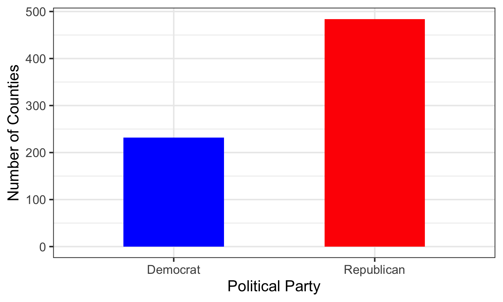
```

```{r individual-vote-plot, out.width = "80%", fig.cap = "Individual Level Vote Distribution", fig.align='center', echo = FALSE}
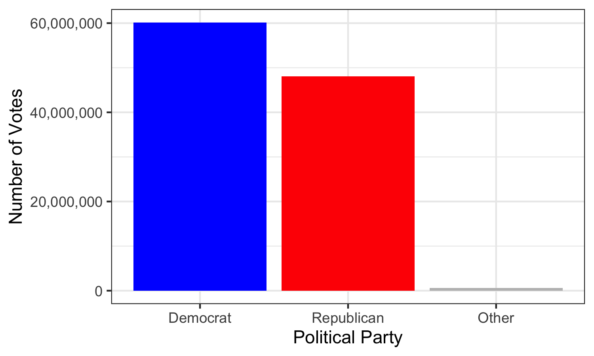
```

```{r election-map, out.width = "80%", fig.cap = "Map of Leading Party", fig.align='center', echo = FALSE}
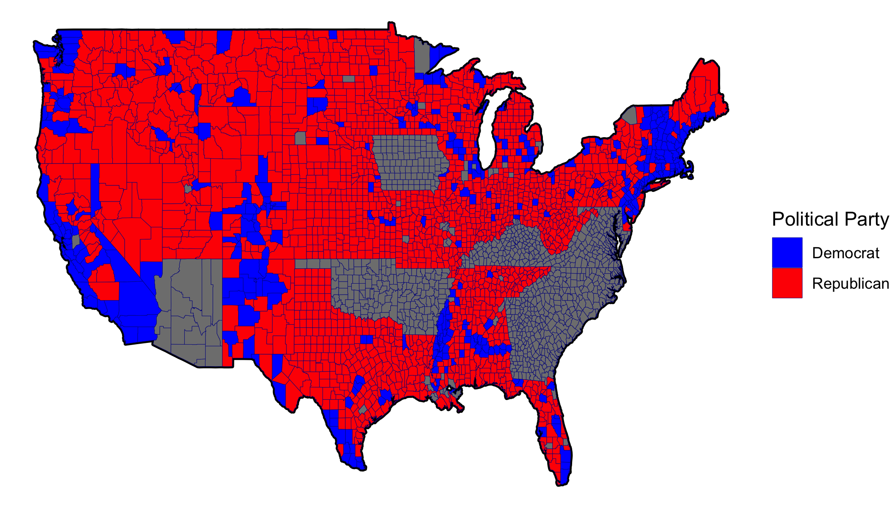
```

To get a bit more granular, we can also see the top 10 most Democrat, most Republican, and most civically engaged counties in our data set. As we see amongst the top 10 most concentrated Democrat-voting counties (Figure \@ref(fig:top-10-dem)), there is a ton of variation in the state with a couple extremely large counties (like New York and Alameda) and other large-sized counties with voting populations in the hundreds of thousands. Among the top 10 most Republican counties (Figure \@ref(fig:top-10-reps)), we see less variation in states, with Alabama and Texas showing up several times. Furthermore, there are no big counties among this list with a large showing of much smaller counties among this top 10 (counties reaching at most 40,000 voters). Amongst the top counties that have individuals who don’t vote for either Republicans or Democrats (Figure \@ref(fig:top-10-other)), we see that that there are both really large counties (such as Davidson and Madison with hundreds of thousands of voters) and some small to mid-sized counties as well. One interesting thing to note is that Tennessee shows up many times in this list, indicating that Tennessee is not particularly polarized to a certain party (even though Tennessee ending up voting red in the 2020 election). Finally, amongst the most civically engaged counties (the counties who had the highest % of their population vote), we see that some well-known swing states appeared on the list (Florida, Michigan, and Maine). Furthermore, the counties whose states are not particularly swing states have relatively close races, with some of them being a near 50-50 split. This indicates that the people of these counties felt some degree of voter efficacy when casting their ballot (Figure \@ref(fig:top-10-voters)).

```{r top-10-dem, message = FALSE, echo = FALSE}
read_tsv("../results/top-10-dems-data.tsv") %>%
  kable(format = "latex", row.names = NA, 
        booktabs = TRUE, digits = 2, 
        col.names = c("County", "State", "% Democrat", "% Republican", "% Other", "% Voted of Population", "Total Votes"),
      caption = "Top ten democrat-voting counties 
        (expressed as a percentage).") %>%
  kable_styling(position = "center")
```

```{r top-10-reps, message = FALSE, echo = FALSE}
read_tsv("../results/top-10-reps-data.tsv") %>%
  kable(format = "latex", row.names = NA, 
        booktabs = TRUE, digits = 2, 
        col.names = c("County", "State", "% Democrat", "% Republican", "% Other", "% Voted of Population", "Total Votes"),
      caption = "Top ten republican-voting counties 
        (expressed as a percentage).") %>%
  kable_styling(position = "center")
```

```{r top-10-other, message = FALSE, echo = FALSE}
read_tsv("../results/top-10-other-data.tsv") %>%
  kable(format = "latex", row.names = NA, 
        booktabs = TRUE, digits = 2, 
        col.names = c("County", "State", "% Democrat", "% Republican", "% Other", "% Voted of Population", "Total Votes"),
      caption = "Top ten other-voting counties 
        (expressed as a percentage).") %>%
  kable_styling(position = "center")
```

```{r top-10-voters, message = FALSE, echo = FALSE}
read_tsv("../results/top-10-voters-data.tsv") %>%
  kable(format = "latex", row.names = NA, 
        booktabs = TRUE, digits = 2, 
        col.names = c("County", "State", "% Democrat", "% Republican", "% Other", "% Voted of Population", "Total Votes"),
      caption = "Top ten voter-turnout counties 
        (expressed as a percentage).") %>%
  kable_styling(position = "center")
```


### Features
First, we would like to take a dive into some of the most prominent features among the 42 explanatory variables in our master dataset. Among these were relative health ratings (according to County Health), education, poverty, unemployment, and COVID deaths. As we can see in the health ratings map, we see that health across the country is equally bad with some healthier areas in South Texas. Due to the spread of these health ratings, there isn’t a meaningful insight we can draw from this map. On the next map regarding education, we see that the central/south dataset and a small pocket near the middle east coast has a relatively lower percentage of people with associate's degrees or more. If we examine the electoral map, we see that the central/south dataset is predominantly Republican while the pocket mentioned before is a mix of Democrat and Republican. Regarding poverty, it is apparent that the coasts are much poorer than their inland counterparts, which could be a telltale sign of whether a county is more blue or more red. And similarly, we see that the coasts have higher unemployment rates, too, which further supports the degree of poverty evident in these areas. According to the COVID map (which isn’t too populated in the first place), we see that the coasts have a much lower percentage of COVID deaths to total deaths relative to the central U.S. This would make sense since much of Trump's following refuse to abide by mask mandates and vaccination policies, thus leading to higher COVID deaths.

After understanding the variation in some of the individual features, we wanted to check for potential multicollinearity issues by looking at the covariation between features. In order to do this, we examined the correlation coefficients between the numerical features (all features in the dataset are numerical except 1).

```{r top-5-pos-corr, message = FALSE, echo = FALSE}
read_tsv("../results/ordered_corrDF.tsv")[-1,] %>%
  tail(5) %>%
  kable(format = "latex", row.names = NA, 
        booktabs = TRUE, digits = 2, 
        col.names = c("Feature 1", "Feature 2", "Correlation Coefficient"),
        caption = "Top ten most positively correlated feature pairs") %>%
  kable_styling(position = "center")
```

```{r top-5-neg-corr, message = FALSE, echo = FALSE}
read_tsv("../results/ordered_corrDF.tsv")[-1,] %>%
  head(5) %>%
  kable(format = "latex", row.names = NA, 
        booktabs = TRUE, digits = 2, 
        col.names = c("Feature 1", "Feature 2", "Correlation Coefficient"),
        caption = "Top ten most negatively correlated feature pairs") %>%
  kable_styling(position = "center")
```

As we discussed earlier, our features fall into natural categories relating to the health, demographic, and socioeconomic information of each county's residents. We defined a strong correlation as one where the correlation coefficient is greater thatn 0.7 or less than -0.7. From calculating these correlation coefficients, it seems like the feature pairs with the highest absolute correlation coefficients often fall into the same category. For example, `pct_high_school_diploma` and `pct_bachelors_or_higher` have a strong negative correlation, likely because they imply opposite conclusions, and are both related to education. We used this insight to inform our model selection, opting for penalized regressions that drop or diminish features that don't meet a certain threshold, and tree models that circumvent multicollinearity issues altogether. 

### Response vs. Features
Since our response variable was categorical, and the majority of our explanatory variables were numerical, it was difficult to get a snapshot of the potential relationships through something like a correlation matrix. Instead, since we observed that features lying in the same natural categories (e.g. health, demographics, etc.) tended to have moderate to strong correlations with each other, we decided to pick a few features from each category to plot against the response. 

*Health*
```{r health-box, out.width = "80%", fig.cap = "Distribution of health scores by leading party", fig.align='center', echo = FALSE}
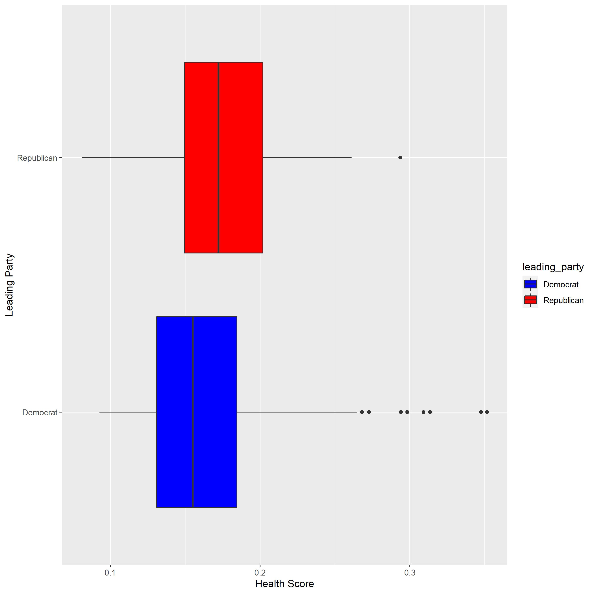
```

High health score indicates a fair standard of health among residents across the county, while a low health score indicates a poor standard of health among residents across the county. This graph shows quite a bit of overlap between parties, but the mean health score for Democrat-won counties is slightly lower than for Republican-won counties. This is especially interesting given how many outliers there are towards the right end of the distribution (i.e. the high scores) for Democrat-won counties.

*COVID*
```{r mask-bar, out.width = "80%", fig.cap = "Distribution of mask survey responses by leading party", fig.align='center', echo = FALSE}
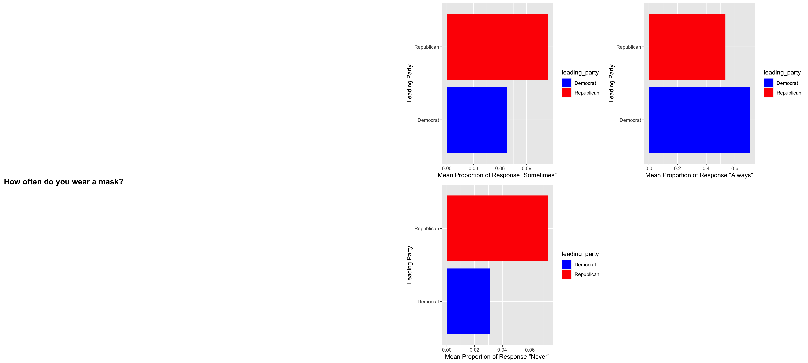
```

The variables in these graphs come from survey data about residents’ mask habits in response to the COVID-19 pandemic. It is interesting to note that the mean proportion of people who responded “Always” is higher in Democrat-won counties than in Republican-won counties. However, the difference seems small, and the mean proportion of “Always” responses is higher for counties won by both parties than the mean proportion of any other response. 

*Demographic/Socioeconomic*
a) Education
```{r edu-box, out.width = "80%", fig.cap = "Distribution of % bach. degree holders by leading party", fig.align='center', echo = FALSE}
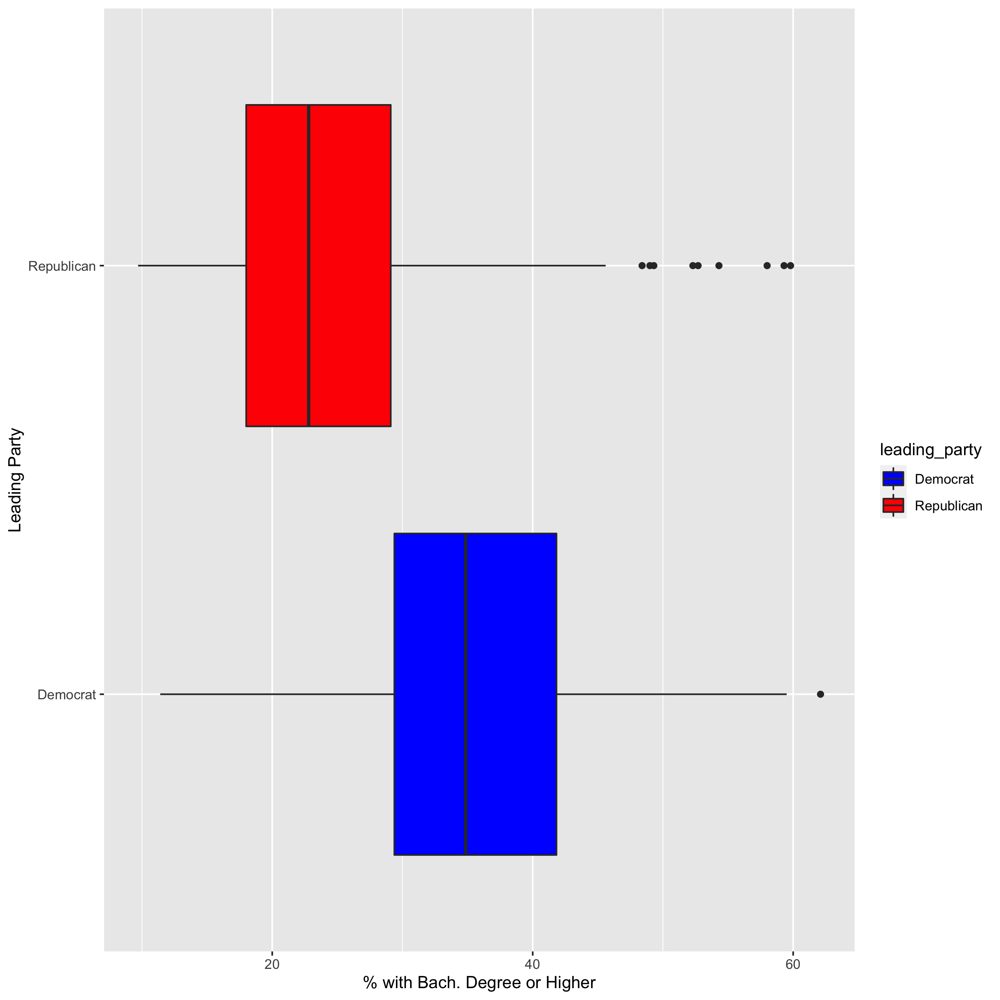
```

According to this boxplot, in Democrat-won counties, the average percentage of bachelor or advanced degree holders seems to be higher than in Republican-won counties; interestingly, there seem to be quite a few outliers to the right end of the distribution for Republican-won counties, indicating that in some instances, highly-educated citizens vote Republican.

b) Race/Ethnicity
```{r race-plots, out.width = "80%", fig.cap = "Distribution of race/ethnicity by leading party", fig.align='center', echo = FALSE}
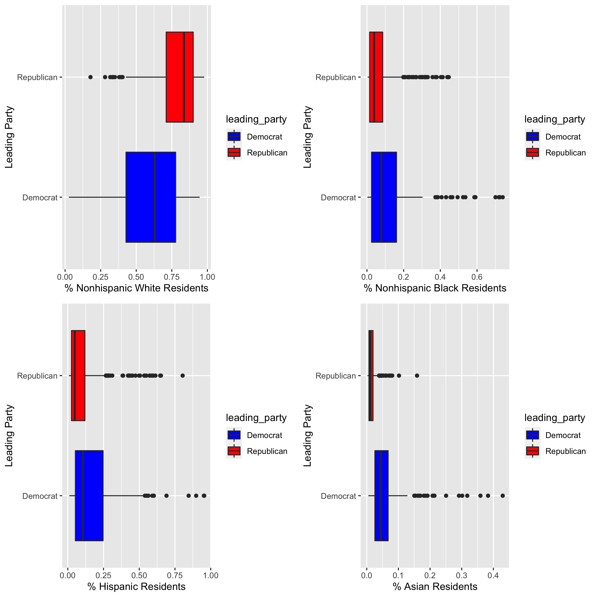
```

Notably, there seems to be quite a bit of overlap between Democrat- and Republican-won counties for all races/ethnicities except for Asian residents; here, there seems to be a stark contrast where counties with higher percentages of Asian residents tend to go blue, whereas counties with lower percentages tend to go red.
 

# Modeling

## Regression-based methods

###Logistic Regression
*Training*
As a baseline model, we began by building a logistic regression. We used the training set to fit a model that regressed `leading_party` on all the other variables in the dataset. During our exploratory analysis, there were a few variables whose distributions demonstrated high skewness. We decided to perform a log transformation on these variables so that they approached a more normal distribution. 

*Interpretation*
The logistic regression contains 46 total parameters, excluding the intercept. Setting $\alpha = 0.05$, there are 17 variables whose p-values meet that level of significance:
`adult_smoking`, `pct_below_18`, `pct_above_65`, `pct_nonhispanic_black`, `pct_native_american`, `pct_hispanic`, `pct_females`, `pct_nonproficient_english`, `physical_inactivity`, `pct_asian`, `pct_nonhispanic_white`, `social_associations`, `urban_rural_descMedium metro`, `urban_rural_descMicropolitan`,`pct_covid_deaths`, `log_poverty_rating`, `pct_voters`
```{r model-comparison, message = FALSE, echo = FALSE}
read_table("../results/glm-coef-p.txt") %>%
  kable(format = "latex", row.names = NA,
        booktabs = TRUE, digits = 2,
        caption = "Summary of logistic regression coefficients, standard errors, 
        and p-values") %>%
  kable_styling(position = "center")
```

It is interesting to see that many of the race/ethnicity variables are significant predictors of election results, given the trend we noticed between `leading_party` and `pct_asian`. However, one potential concern is that more than half the variables are not statistically significant at even $\alpha = 0.10$ despite having very high coefficient values. This is a sign that multicollinearity could be at play, a potential risk we noted in our exploratory analysis when certain features demonstrated strong correlations with each other. 

###Penalized regression methods 
*Training & Tuning*
The baseline logistic regression yielded several significant predictors, but with 46 parameters, there was high overfitting potential when it came to the test data. In order to balance the bias-variance tradeoff, and additionally to deal with the multicollinearity issues, we decided to apply two penalized methods: ridge and LASSO classifiers. We trained these cross-validated models on the same training dataset used to construct our earlier logistic regression. Additionally, for each model, we selected the tuning parameter $\lambda$ according to the one standard error rule. Following this training and tuning process, the LASSO model contained the following 21 predictors:
`homeownership`,`pct_bachelors_or_higher`,`always`,`log_poverty_rating`,`unemployment_rate`,`physical_inactivity`,`pct_nonhispanic_black`,`pct_voters`,`pct_nonhispanic_white`,`diabetes_prevalence`,`pct_asian`,`pct_covid_deaths`,`sometimes`,`log_traffic_volume`,`pct_above_65`, `pct_females`, `frequently`, `severe_housing_issues`, `pct_below_18`, `excessive_drinking`, `pct_college_associates`. 

*Interpretation*
Looking at the trace plots for the ridge and LASSO models, which highlight the top 6 most important features, it is interesting to examine the overlap across the three regression-based methods we used to approach this problem.

```{r ridge-trace, out.width = "80%", fig.cap = "Ridge Trace Plot", fig.align='center', echo = FALSE}
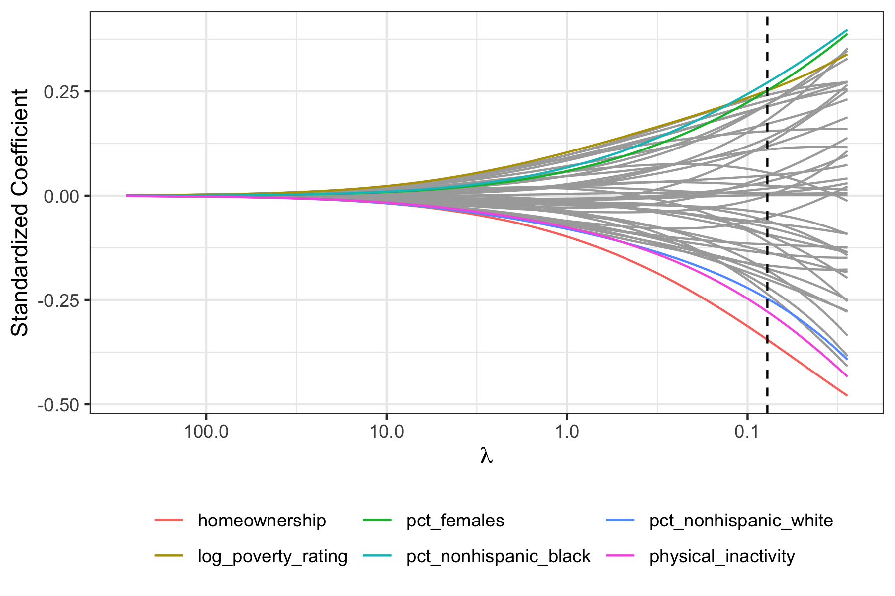
```

```{r lasso-trace, out.width = "80%", fig.cap = "LASSO Trace Plot", fig.align='center', echo = FALSE}

```

Notably, three features show up in the top 6 most important features for both the LASSO and ridge classifiers: `homeownership`, `pct_bachelors_or_higher`, `log_poverty_rate`. Of these predictors `log_poverty_rate` was also a statistically significant predictor in the logistic regression. This overlap points to certain demographic/socioeconomic indicators, especially relating to education and income level, as particularly important in determining political party. 

##Tree methods
In addition to our regression-based methods, we also wanted to use a few tree-based models to attempt this classification question. Given our initial challenge with the logistic regression’s requirement regarding multicollinearity, tree methods seemed like an appropriate next step. Given that the trees involved in these models are formed based not on assumptions about how the explanatory and response variables are related, but on an impurity measure at each split, these methods successfully avoid multicollinearity. This is especially helpful given the way our data falls into natural groupings. 

### Decision tree
*Training & Tuning*
We started out by constructing some classification trees to gain further insight into the relationship between the features and the response. This was our baseline classification tree:

```{r default-tree, out.width = "80%", fig.cap = "Default Tree", fig.align='center', echo = FALSE}
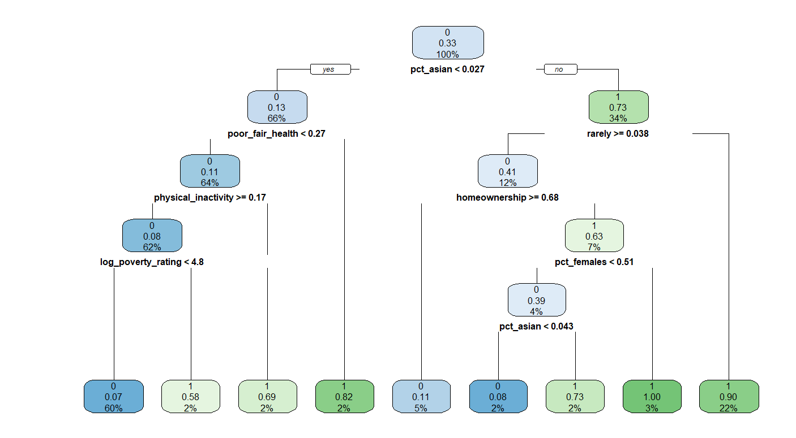
```

The `pct_asian` variable is at the root node, reinforcing its importance as a predictor of `leading_party` as noted in the exploratory analysis, and further solidified through the regression-based models.

*Interpretation*
To avoid increasing bias by pruning this default tree, we fit the deepest possible tree. We then cross-validated and used the one standard error rule to pick the number of terminal nodes that would result in the optimal tree. This was the optimal tree:

```{r optimal-tree, out.width = "80%", fig.cap = "Optimal Tree", fig.align='center', echo = FALSE}
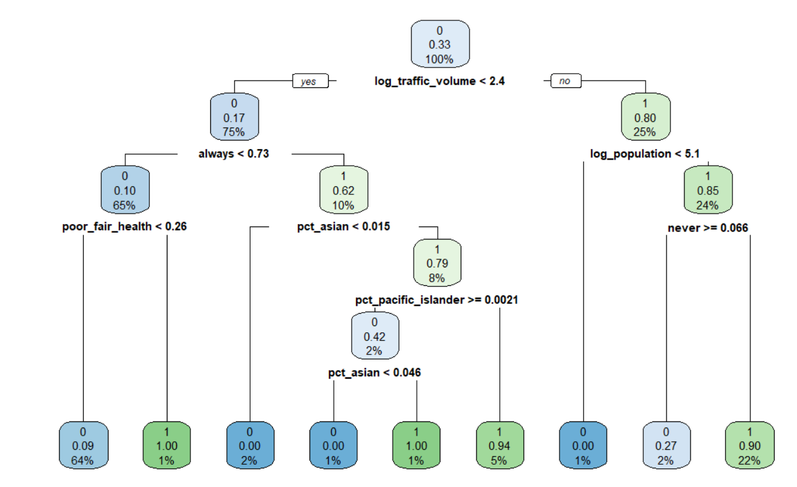
```

Once again, the reappearance of several features that were important in previous models reinforces our earlier results.

### Random forest
*Training and Tuning*
Next, using the same training set, we fit a random forest model. In this case, there were two key tuning parameters: 
`mtry`, which represents the number of variables the model randomly samples to pick each split 
`ntree`, which represents the number of trees that should be used in determining each prediction
In order to tune the random forest according to these parameters, we measured the out-of-bag error associated with different values of each parameter. The out-of-bag (OOB) error measures how well the random forest is able to predict values not included in the bootstrap samples used to train the forest. In this way,  OOB error acts as a validation mechanism for the random forest model. 

```{r m-OOB-err-plot, out.width = "80%", fig.cap = "OOB Error vs. Mtry Parameter", fig.align='center', echo = FALSE}
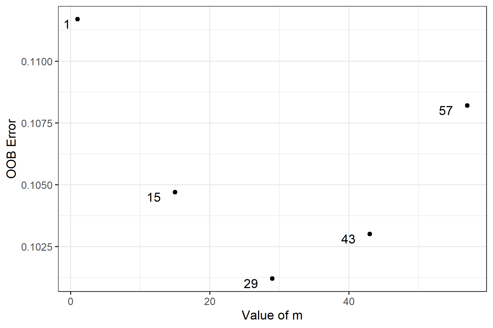
```

Here we see that the optimal `mtry` value is 29, because that is where OOB error is minimized.

```{r def-OOB-err-plot, out.width = "80%", fig.cap = "OOB Error vs. Number of Trees", fig.align='center', echo = FALSE}
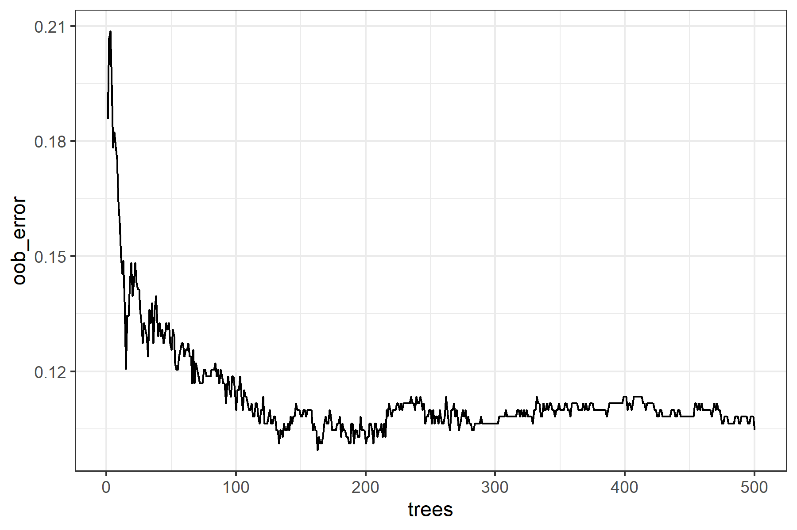
```

Similarly, we see that OOB error begins to stabilize as `ntrees` approaches 500, meaning this is the optimal value for that parameter. 

*Interpretation*
In order to answer our research question, it is important to understand which variables the model highlights as important. With random forests, variable importance is determined by two key measures: mean decrease in accuracy, and mean decrease in Gini coefficient. The first signifies how much the model would lose in terms of accuracy by excluding a certain variable, and the second signifies how much a certain variable decreases impurity at a certain node.  

```{r rf-varimp, out.width = "80%", fig.cap = "Variable Importance", fig.align='center', echo = FALSE}
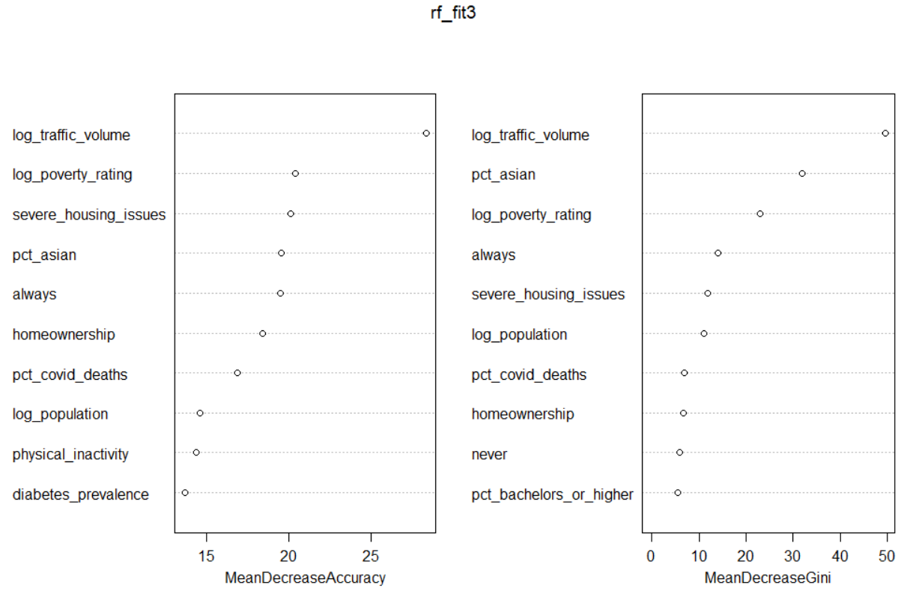
```

Looking at the variable importance plots, it is interesting to see how much the two overlap with each other, and how much these rankings overlap with the variable importance expressed by previous models. The following are variables that not only meet both of metrics of variable importance set out by the random forest model, but were also among the most 
important/significant features in previous models:
`log_traffic_volume`, `log_poverty_rating`, `pct_asian`, `always`, `homeownership`
These variables reveal insight into a county’s socioeconomic status, racial/ethnic composition, and COVID-19 reaction. Importantly, they also convey the particular relevance of these issues to election results. 

### Boosting
*Training & Tuning*
Lastly, we used our training dataset to fit a boosted model, which works by aggregating the predictions of multiple weak learners to form a strong predictive ability. Here, our key tuning parameter was interaction depth - this determines the maximum number of nodes for a decision tree. We tested interaction depths of 1, 2, and 3, plotting the number of trees at each depth against the cross-validation error to determine the optimal depth. We determined this value to be 3. Cross-validation error is minimized at an interaction depth of 3 and 133 trees. 

```{r gbm-CV-errs, out.width = "80%", fig.cap = "Variable Importance", fig.align='center', echo = FALSE}
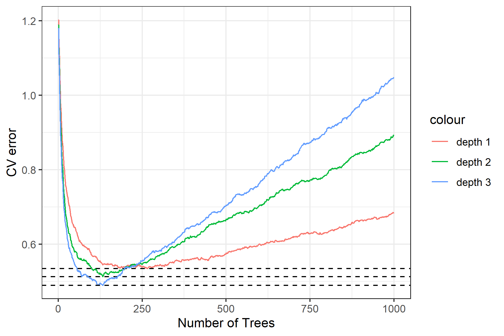
```

*Interpretation*
According to relative influence, the top three most important features in the boosted model are:
`log_traffic_volume`, `log_poverty_rating`, and `severe_housing_issues`. Once again, these features overlap with important features highlighted by our earlier models. 
```{r rel-inf, message = FALSE, echo = FALSE}
read_tsv("../results/gbm-rel-inf.tsv") %>%
  kable(format = "latex", row.names = NA,
        booktabs = TRUE, digits = 2,
        caption = "Relative Influence") %>%
  kable_styling(position = "center")
```

Taking these variables, we proceeded to create partial dependence plots. These plots demonstrate the marginal effect of a feature on the response variable. In the case of `log_traffic_volume`, we can see that as the log of the average traffic volume per meter of major roadways in the county increases, the election result is more likely to be Democrat. Similarly, with relation to the other plots, the election result also becomes more likely to be Democrat as the log of a county’s poverty rating increases; as the proportion of the county facing severe housing issues or homelessness increases, so does the likelihood that the election result is Democrat. 

```{r part-dep-plots, out.width = "80%", fig.cap = "Variable Importance", fig.align='center', echo = FALSE}
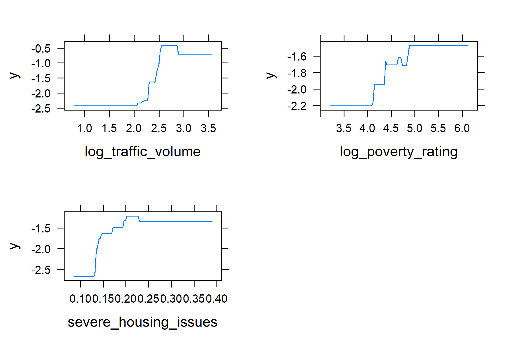
```

Taking a holistic view of the relationship between these three variables and the response, it seems like counties lacking access to robust public infrastructure seem to lean Democrat. It is possible, at least from the residents’ point of view, that the Democratic Party’s policy agenda is better suited to address the challenges arising from high levels of poverty, homelessness, and even traffic congestion. 


# Conclusions

## Method comparison

```{r model-evaluation, message = FALSE, echo = FALSE}
read_csv("../results/model-evaluation.csv") %>%
  kable(format = "latex", row.names = NA,
        booktabs = TRUE, digits = 2,
        caption = "Misclassification Errors") %>%
  kable_styling(position = "center")
```

Table \@ref(tab:model-evaluation) 

## Takeaways

Our results point to a few key determinants of health that, given their impact on COVID-19 deaths per cases rates in 2020, policymakers should consider when aiming to improve factors that would improve health overall but also potentially mitigate the mortality risk of another pandemic. The boosted model, which had the strongest predictive performance, suggests that residential segregation between non-white and white residents is the most important variable in predicting a county’s COVID-19 deaths per cases rate. The unemployment rate, availability of physical exercise opportunities, and measures of home ownership burden variables were also highly important in this model. These variables are identified across all models suggesting these relationships are robust. Residential segregation, unemployment, and home ownership burden are socioeconomic factors that affect an individual’s ability to access and pay for healthcare. In that regard, it is unsurprising that these factors would have a greater ability to predict differences in COVID-19 case fatalities across different counties in the United States. While some behavioral variables are also found to be significant (including STI incidence, high school completion, and others identified in the elastic net and lasso regressions), the variable importance ranking from the boosted model provides a highly interpretable hierarchy of the most influential factors from the greater set.

Given that socioeconomic factors were the strongest predictors of deaths per cases, it appears that on the county level, COVID-19 rates are most associated with community healthcare burdens. That is, COVID-19 outcomes appear to reflect the reality of healthcare accessibility across counties; those with high percentages of uninsured citizens, or with high degrees of segregation and inequality, might feature division of healthcare resources that reflects these disparities. It is thus reasonable that deaths per case rates would be higher when significant groups of a population have lesser access to healthcare resources and treatment. Notably, if our conclusions are indeed correct, this effect would likely be pronounced in situations of scarcity such as the early months of the pandemic studied here, when many hospitals faced shortages of ventilators and other resource shortages. Given the progression of COVID-19 since 2021 as well as the inherent complexity of fatality incidence, we are hesitant to make any assertive claims about the true predictive capacity of any of the top factors we identified. Nonetheless, these results can help inform policies directed toward improving various determinants of important health outcomes in counties across the US.  

As the world shifts towards herd immunity as vaccines are made more widely available, it is important to reflect upon how the pandemic has asymmetrically impacted different counties across the country. Our results suggest that structural vulnerabilities can be captured by measures of inequality and poverty; the identification of counties high on these factors should serve as a warning for future vulnerability to health crises. These analyses can serve to protect already vulnerable communities from suffering disproportionately in the future. 

## Limitations

### Dataset limitations

One limitation is the fact that the consolidated dataset doesn’t have the data for all 3,000+ counties in the dataset. We only have less than 25% of the counties in the dataset accounted for. Many of our observations had to be removed as some of the R packages used to build some of our models required that no NA values were present in the data, which led to why we left out so many counties from our analysis. There is also some evidence of correlation amongst some of our explanatory variables. This means that some variables can be confounding variables, which would then mask or distort the relationship between measured variables. Also, variables selected in the LASSO regression and elastic net regression as well as variables marked important in the tree methods might be misleading in that, given how variable selection works, it is possible that some selected variables are simply representative of a larger group of correlated variables. Another limitation is that we have much fewer explanatory variables than we started with in the cleaning process. It would be ideal to have the full 100+ features from the County Health dataset, but due to too many columns having NA values, we had to scrap them. Removing the feature altogether was preferable to simply removing the observation because many observations had NAs for some columns.

### Analysis limitations

While splitting the data into training and testing datasets allows for a more unbiased test of the models, we recognize that our conclusions inherently contain some randomness due to the random split of the data. In other words, splitting the data again using a different random seed may have yielded different predictions and thus different misclassification errors. Next, although we provide different methods for robust interpretation of the variables, our analysis incorporates only a specific subset of health related variables. The results of the analysis might change dramatically if we were to incorporate other variables.

## Follow-ups
Regarding the study itself, we would like to find a better balance between removing observations vs. features when there are many NAs present. Perhaps, we could clean the dataset to instead remove columns with a certain amount of NAs present (like 20+). That would help us balance having a lot of observations and a lot of features.

For other matters to follow-up on, we would like to see other metrics that could predict party preferences. For instance, it would be interesting to examine the proportion of mail-in absentee voting in a county. It could be that counties with more mail-in/absentee voting would vote more towards the Democrat party. Furthermore, we’d like to look at data regarding social media consumption during the election and how time a county spent on each platform (e.g., Facebook, Instagram, Twitter, Tiktok, etc.). This could influence voting because we know that there was plenty of misinformation spread about the election through these platforms. We believe that spending time on platforms like Facebook (which have been repeatedly scorned for misinformation spreading and not validating it) could lead to more Trump votes. Another feature we’d like to study is the age distribution of voters. Perhaps it is that older citizens tend to vote for the Republican party and younger voters vote Democrat.

\appendix

# Appendix: Descriptions of features {#appendix}

Below are the 41 features we used for analysis. Words written in parentheses represent variable names. Unless noted otherwise, all variables are continuous. 

- *Tobacco Use*
  - Adult smoking (`smoke_perc`): Percentage of adults who are current smokers.
- *Diet and Exercise* 
  - Adult obesity (`obesity_perc`): Percentage of the adult population (age 20 and older) reporting a body mass index (BMI) greater than or equal to 30 kg/m2.
  - Food environment index (`food_environment`): Index of factors that contribute to a healthy food environment, from 0 (worst) to 10 (best).
  - Physical inactivity (`inactive_perc`): Percentage of adults age 20 and over reporting no leisure-time physical activity.
  - Access to exercise opportunities (`physical_exercise_opportunities`): Percentage of population with adequate access to locations for physical activity
  - Food insecurity (`Food_Insecure_perc`): Percentage of population who lack adequate access to food.
  - Limited access to healthy foods (`limited_healthy_access`): Percentage of population who are low-income and do not live close to a grocery store.
- *Alcohol & Drug Use*
  - Excessive Drinking (`drinking_perc`): Percentage of adults reporting binge or heavy drinking.
- *Sexual Activity*
  - Sexually transmitted infections (`stis`): Number of newly diagnosed chlamydia cases per 100,000 population.
  - Teen births (`teen_births`): Number of births per 1,000 female population ages 15-19.
  - Low Birth Weight Percentage (`low_birthweight_percentage`): Percentage of live births with low birthweight (< 2,500 grams).
- *Access to Care*
  - Uninsured (`uninsured`): Percentage of population under age 65 without health insurance.
  - Primary care physicians (`primarycare_ratio`): Ratio of population to primary care physicians.
  - Dentists (`dentist_ratio`): Ratio of population to dentists. 
  - Mental health providers (mentalhealth_ratio): Ratio of population to mental health providers.
  - Other primary care providers (`otherproviders_ratio`): Ratio of population to primary care providers other than physicians.
- *Quality of Care*
  - Preventable hospital stays (`preventable_hospitalization`): Rate of hospital stays for ambulatory-care sensitive conditions per 100,000 Medicare enrollees.
  - Mammography screening (`mammogram_perc`): Percentage of female Medicare enrollees ages 65-74 that received an annual mammography screening.
  - Flu vaccinations (`flu_vaccine_perc`): Percentage of fee-for-service (FFS) Medicare enrollees that had an annual flu vaccination.
  - Teen births (`teen_births`): Number of births per 1,000 female population ages 15-19.
- *Education*
  - High school completion (`HS_completion`): Percentage of adults ages 25 and over with a high school diploma or equivalent.
  - Some college (`some_college`): Percentage of adults ages 25-44 with some post-secondary education.
  - Disconnected youth (`disconnected_youth`): Percentage of teens and young adults ages 16-19 who are neither working nor in school.
- *Employment*
  - Unemployment (`unemployment`): Percentage of population ages 16 and older who are unemployed but seeking work.
- *Income* 
  - Children in poverty (`children_poverty_percent`): Percentage of people under age 18 in poverty.
  - Income inequality (`income_inequality`): Ratio of household income at the 80th percentile to income at the 20th percentile.
  - Median household income (`median_income`): The income where half of households in a county earn more and half of households earn less.
  - Children eligible for free or reduced price lunch (`children_freelunches`): Percentage of children enrolled in public schools that are eligible for free or reduced price lunch.
- *Family & Social Support*
  - Children in single-parent households (`single_parent_households`): Percentage of children that live in a household headed by a single parent.
  - Social associations (`social_associations`): Number of membership associations per 10,000 residents. 
  - Residential segregation—Black/White (`segregation_black_white`): Index of dissimilarity where higher values indicate greater residential segregation between Black and White county residents.
  - Residential segregation—non-White/White (`segregation_nonwhite_white`): Index of dissimilarity where higher values indicate greater residential segregation between non-White and White county residents.
- *Community Safety*
  - Violent crime rate (`Violent_crime`) Number of reported violent crime offenses per 100,000 residents. 
- *Air & Water Quality*
  - Air pollution - particulate matter (`air_pollution`): Average daily density of fine particulate matter in micrograms per cubic meter (PM2.5).
  - Drinking water violations (`water_violations`): Indicator of the presence of health-related drinking water violations. 1 indicates the presence of a violation, 0 indicates no violation.
- *Housing & Transit*
  - Housing overcrowding (`housing_overcrowding`): Percentage of households with overcrowding, 
  - Severe housing costs (`high_housing_costs`): Percentage of households with high housing costs
  - Driving alone to work (`driving_alone_perc`): Percentage of the workforce that drives alone to work.
  - Long commute—driving alone (`long_commute_perc`): Among workers who commute in their car alone, the percentage that commute more than 30 minutes.
  - Traffic volume (`traffic_volume`): Average traffic volume per meter of major roadways in the county.
  - Homeownership (`homeownership`): Percentage of occupied housing units that are owned.
  - Severe housing cost burden (`severe_ownership_cost`): Percentage of households that spend 50% or more of their household income on housing.